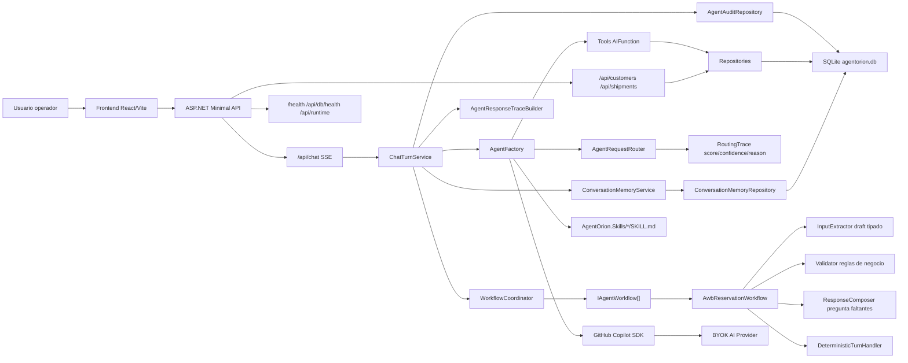
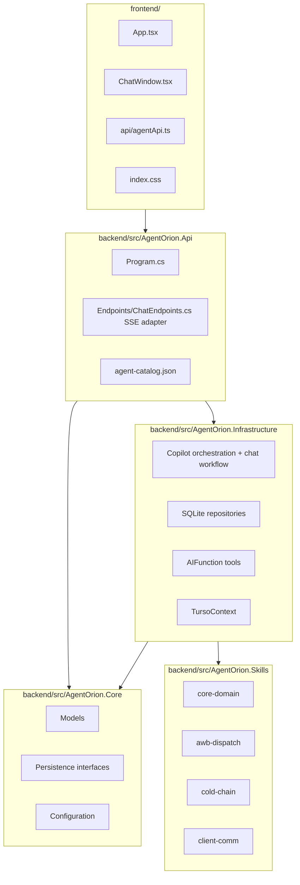
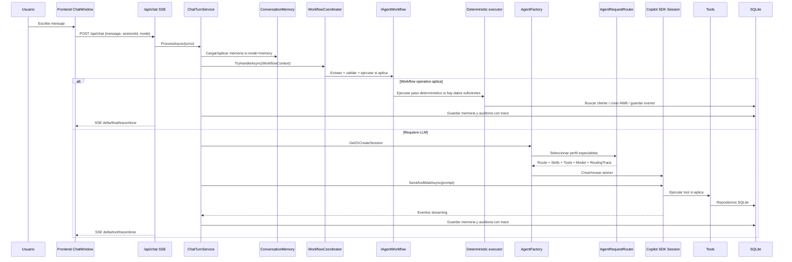
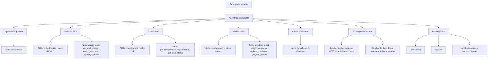
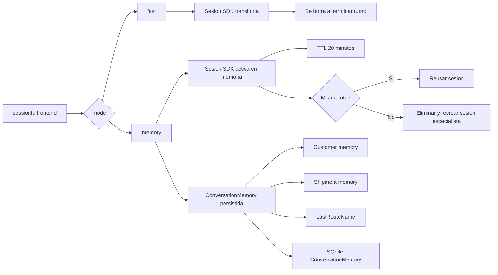
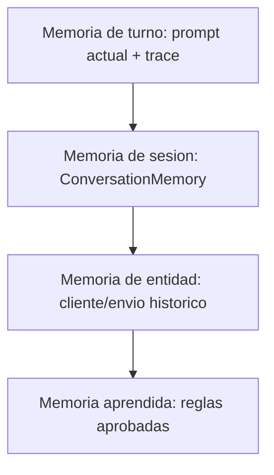
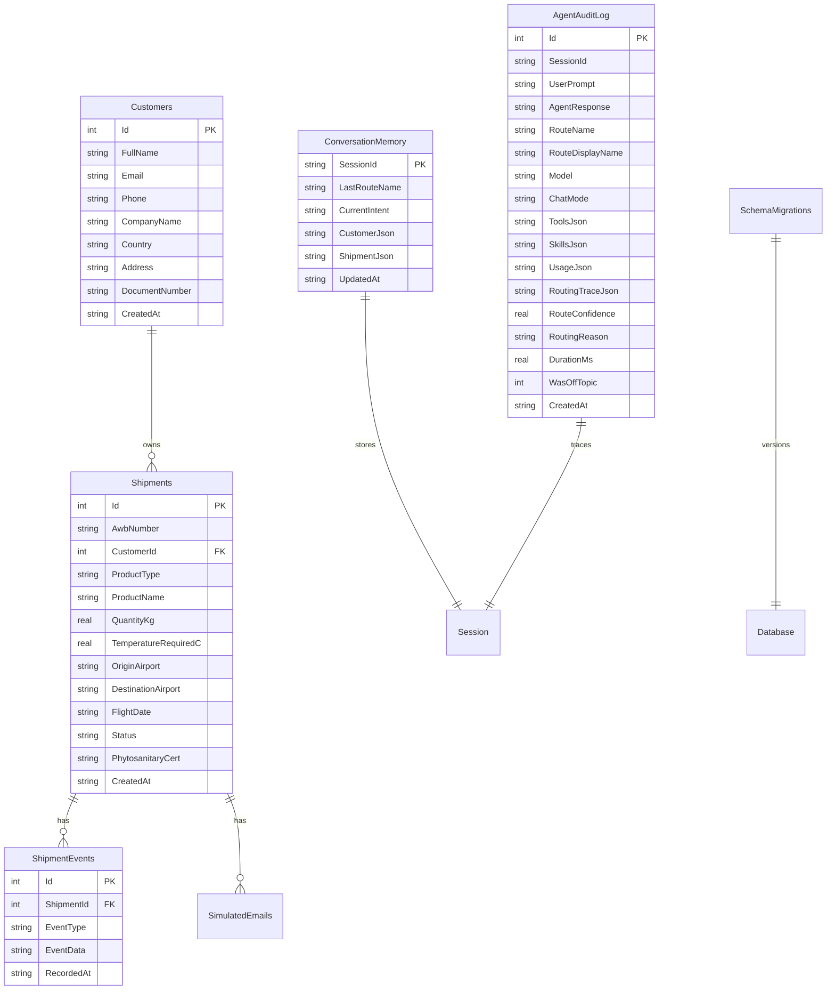
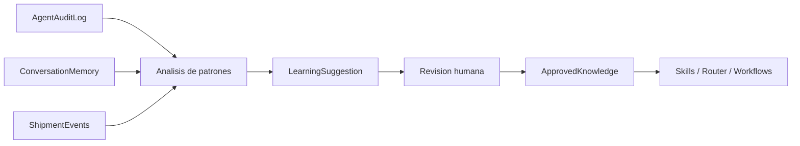
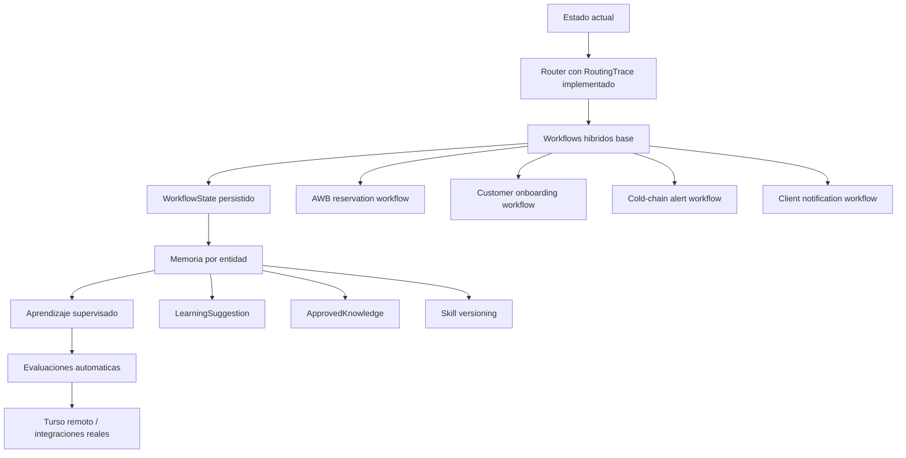

# AgentOrion - Diagrama de arquitectura actual

Este documento muestra la arquitectura actual de AgentOrion al nivel suficiente para entender como viaja una solicitud, donde viven los agentes, como se usan skills/tools/sesiones y donde estan las principales fortalezas y debilidades.

Archivo dedicado con solo diagramas: [DIAGRAMAS-ARQUITECTURA.md](DIAGRAMAS-ARQUITECTURA.md).
Guia del patron de workflows: [WORKFLOWS-HIBRIDOS.md](WORKFLOWS-HIBRIDOS.md).

## 1. Vista general

### Lectura rapida

- El frontend es una consola operativa con chat, AWBs recientes y clientes.
- El backend centraliza chat, CRUD, health, sesion de agente y tools.
- Los agentes no son procesos separados: son perfiles de sesion creados por `AgentFactory`.
- Los workflows de negocio viven antes del LLM: `WorkflowCoordinator` prueba flujos explicitos y cae al SDK si ninguno aplica.
- Las skills son carpetas markdown que se cargan en la sesion del Copilot SDK.
- SQLite es la memoria operativa local: clientes, envios, eventos, emails simulados, memoria y auditoria.

## 2. Capas del monorepo

### Estado actual

- La separacion por capas esta bien encaminada.
- Core contiene modelos y contratos, sin depender de SQLite ni del SDK.
- Infrastructure conoce SQLite, Copilot SDK y tools.
- Api registra dependencias, expone endpoints y sirve el build del frontend.
- `ChatEndpoints.cs` es transporte SSE; `ChatTurnService` vive en Infrastructure y coordina el turno completo.

## 3. Flujo completo de chat

### Puntos fuertes

- Hay dos caminos: deterministico y LLM. Eso baja latencia y costo en casos conocidos.
- El endpoint `/api/chat` ya es una capa delgada de transporte SSE.
- `ChatTurnService` centraliza el turno: lock de sesion, memoria, workflows, LLM, streaming, trace y auditoria.
- `WorkflowCoordinator` reduce acoplamiento: cada proceso implementa extraccion, validacion, ejecucion y respuesta propia.
- El frontend recibe trazabilidad: ruta, confianza, motivo, candidatos, modelo, tools, skills, tokens y duracion.
- La auditoria queda persistida en DB con explicacion de routing.

### Debilidades

- Ya hay contrato base de workflow, pero todavia no hay `WorkflowState` persistido para procesos largos.
- El extractor AWB actual usa reglas; un extractor IA con salida JSON tipada seria el siguiente salto para lenguaje mas libre.
- El trace es reusable, pero aun no existe un endpoint de consulta de auditoria para revisar historicos desde UI.

## 4. Agentes, rutas y skills

### Estado actual del router

- Ya no decide solo por `keyword.Contains`.
- Normaliza acentos, tokeniza el prompt y calcula score por ruta.
- Senales fuertes pesan mas que productos ambiguos.
- Devuelve `RoutingTrace` con candidatos, score, senales, confianza y explicacion.
- La confianza y la razon viajan al frontend y se guardan en auditoria.
- Hay dataset inicial de evaluacion en `backend/tests/AgentOrion.Api.Tests/routing-evaluation-cases.json`.
- Ejemplo: `crear reserva AWB para flores` va a AWB, no a mixto.
- Ejemplo: `validar temperatura para flores` va a cadena de frio.
- Ejemplo: `notificar alerta de temperatura del AWB` va a mixto.

### Debilidades restantes

- El scoring sigue siendo manual.
- El dataset de evaluacion todavia es pequeno.
- No hay calibracion estadistica ni pesos aprendidos desde ejemplos historicos.
- No hay evaluacion semantica de respuesta final, solo de ruta/intencion.

### Mejora recomendada

Evolucionar el router hacia `AgentEvaluation`:

- dataset versionado de prompts reales,
- ruta esperada,
- tools esperadas,
- umbral de confianza,
- respuesta esperada o criterios de calidad,
- reporte automatico de regresiones.

## 5. Sesiones y memoria

### Lo que esta bien

- `fast` evita memoria innecesaria y reduce contexto.
- `memory` permite continuidad por sesion.
- La memoria durable esta en SQLite, no solo en el SDK.
- Si cambia el especialista, la sesion se recrea para evitar mezclar instrucciones incompatibles.

### Riesgos

- Las sesiones SDK activas viven solo en memoria del proceso.
- Si se reinicia el backend, se pierde la sesion viva aunque la memoria estructurada siga.
- La memoria se extrae con reglas regex/manuales; puede fallar en lenguaje mas libre.
- No hay memoria por cliente a largo plazo, solo por conversacion.

### Mejora recomendada

Separar memoria en cuatro niveles:

## 6. Persistencia SQLite/Turso

### Fortalezas actuales

- Hay migraciones versionadas (`SchemaMigrations`).
- Cada conexion activa foreign keys, busy timeout y WAL.
- Hay indices para AWB, cliente, eventos, memoria y auditoria.
- Crear AWB + evento inicial es transaccional.
- Hay endpoint `/api/db/health`.
- Existe abstraccion `IAgentOrionDbConnectionFactory`, util para un adaptador Turso futuro.

### Debilidades actuales

- Las migraciones aun viven dentro de `TursoContext`; cuando crezcan, convendra moverlas a clases/archivos separados.
- No hay unit of work general para flujos complejos multi-repositorio.
- `ConversationMemory` guarda JSON, util ahora, pero dificil de consultar analiticamente.
- No hay versionado de memoria aprendida ni reglas aprobadas.
- No hay soft delete, revision historica ni control de cambios por usuario/sistema.

## 7. Autoaprendizaje: estado real

### Estado actual

El sistema todavia no autoaprende de verdad. Hoy tiene:

- memoria estructurada de conversacion,
- auditoria de turnos,
- skills estaticas,
- tools operativas,
- eventos de negocio.

Eso es una base correcta para aprender despues, pero no es aprendizaje autonomo.

### Forma segura de construir aprendizaje

El aprendizaje deberia ser supervisado:

1. Detectar patrones desde auditoria y eventos.
2. Generar sugerencias.
3. Aprobar o rechazar sugerencias.
4. Versionar conocimiento aprobado.
5. Inyectar conocimiento aprobado en skills/router/workflows.
6. Medir si mejora con evaluaciones.

Nunca conviene que el agente edite sus skills sin aprobacion.

## 8. Fortalezas principales

| Area | Fortaleza |
|------|-----------|
| Arquitectura | Buena separacion Api/Core/Infrastructure/Skills |
| Agentes | Especialistas configurados por catalogo |
| Tools | Acciones reales encapsuladas con `AIFunctionFactory` |
| DB | SQLite endurecido con migraciones, PRAGMAs e indices |
| Memoria | Estado estructurado por sesion |
| Auditoria | Turnos, trazas, confianza y explicacion de routing persistidas |
| Router | Scoring por senales, confianza y dataset inicial de evaluacion |
| Workflow | `WorkflowCoordinator` + extractor/validator/composer por proceso |
| Testing | Hay pruebas backend/frontend y dataset de routing |
| Evolucion | Abstraccion de conexion prepara Turso/libSQL |

## 9. Debilidades principales

| Area | Debilidad | Riesgo |
|------|-----------|--------|
| Router | Scoring manual y dataset pequeno | Puede fallar en prompts nuevos |
| Skills | Son mas documentacion que playbooks | El agente puede actuar de forma inconsistente |
| Workflows | No hay `WorkflowState` persistido ni extractor IA estructurado | Flujos largos aun dependen de memoria heuristica |
| Memoria | Solo sesion, no entidad/aprendizaje | No aprende entre clientes o operaciones |
| DB | Migraciones en `TursoContext` | Se volvera pesado con mas schema |
| Evaluacion | Solo cubre routing inicial | No mide herramientas ni calidad de respuesta |
| Seguridad | Confirmaciones limitadas | Riesgo al conectar endpoints reales |

## 10. Nodos de mejora recomendados

### Prioridad sugerida

1. Extractores IA por workflow: salida JSON tipada, confianza, pruebas golden y fallback a reglas.
2. `WorkflowState`: formalizar pasos de reserva, cliente, alerta y notificacion cuando el flujo sea multi-turno.
3. `AgentEvaluation`: ampliar dataset a ruta + campos extraidos + tool + respuesta + criterios de calidad.
4. `ApprovedKnowledge`: aprendizaje supervisado y versionado.
5. Endpoint/UI de auditoria para revisar trazas historicas.
6. Adaptador Turso remoto cuando la base local ya este estable.

## 11. Decision tecnica actual

AgentOrion ya no es solo un chatbot. La arquitectura actual se parece mas a un copiloto operativo con:

- agentes especialistas,
- tools con acciones de negocio,
- memoria estructurada,
- auditoria persistida con explicacion de routing,
- base SQLite preparada para crecer,
- routing mejorado por scoring y evaluacion inicial.

El siguiente salto no deberia ser "mas prompts". El siguiente salto deberia ser convertir intenciones en workflows hibridos, versionados y medibles: IA para entender/redactar; codigo para validar/ejecutar.
