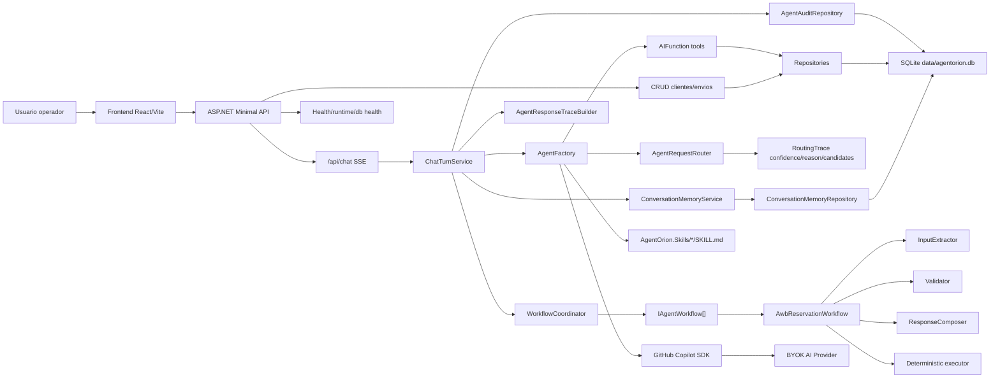
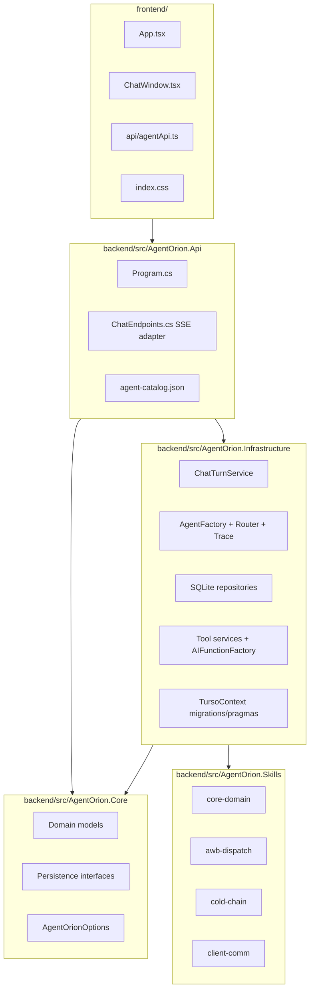
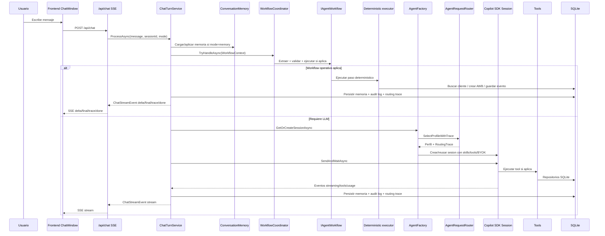
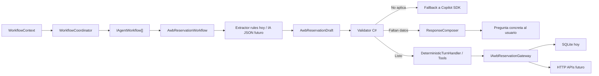
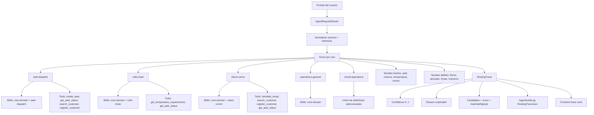
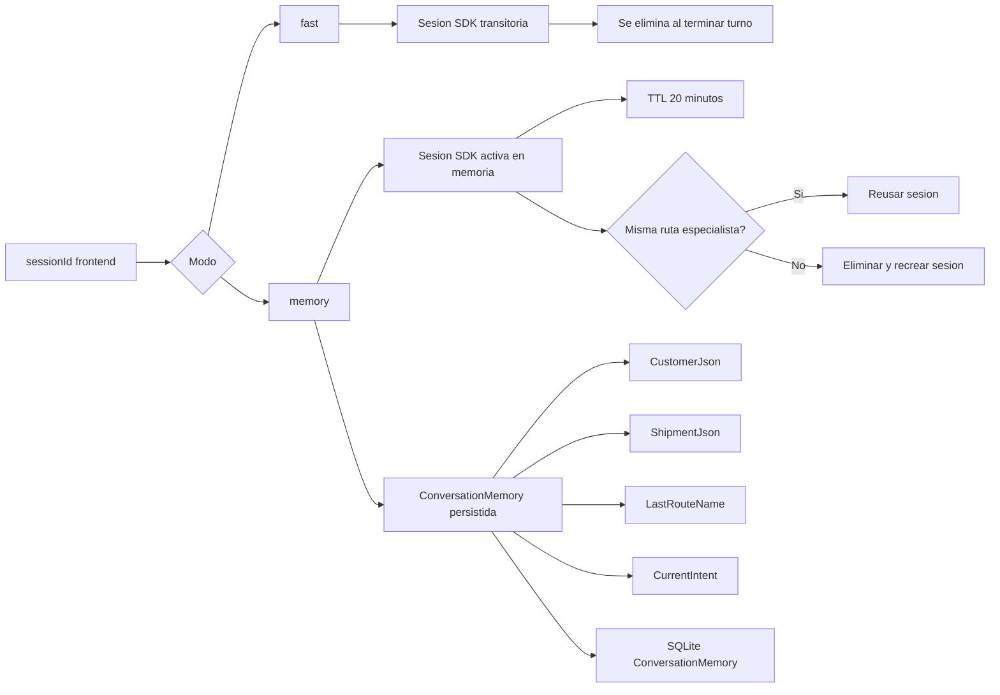
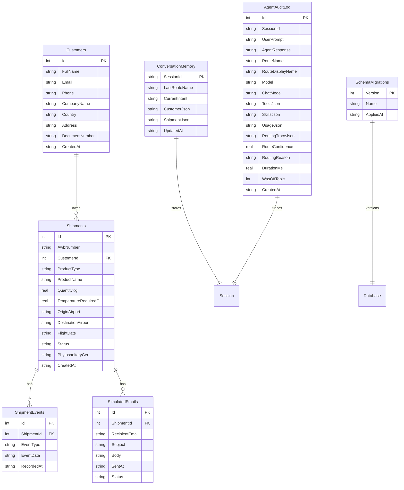
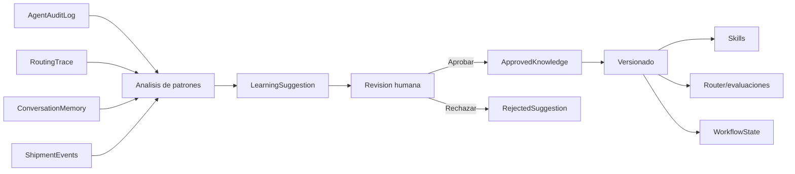
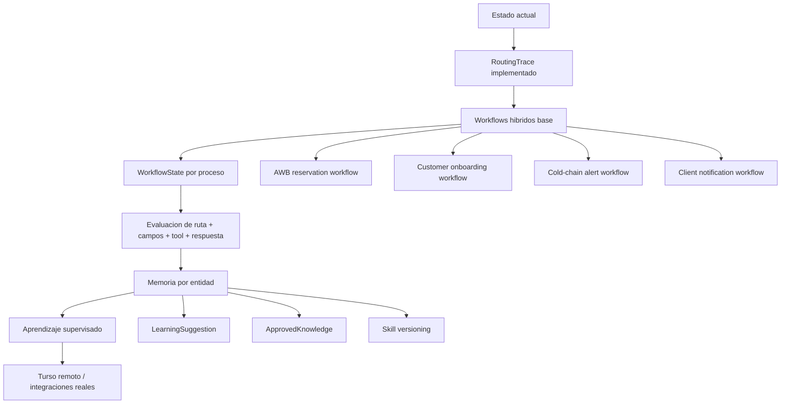

# Diagramas de arquitectura AgentOrion

Este archivo concentra solo los diagramas para revisar la arquitectura sin tener que navegar todo el documento largo. Si el visor no renderiza Mermaid, abre este archivo en VS Code con extension Mermaid, GitHub, Obsidian, o un visor compatible.

## 1. Vista general actual

## 2. Capas del monorepo

## 3. Flujo completo de chat

## 4. Workflow hibrido por proceso

## 5. Router de agentes, skills y tools

## 6. Sesiones y memoria

## 7. Base operativa SQLite/Turso

## 8. Autoaprendizaje supervisado propuesto

## 9. Roadmap de mejora

