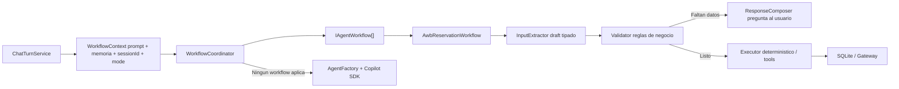
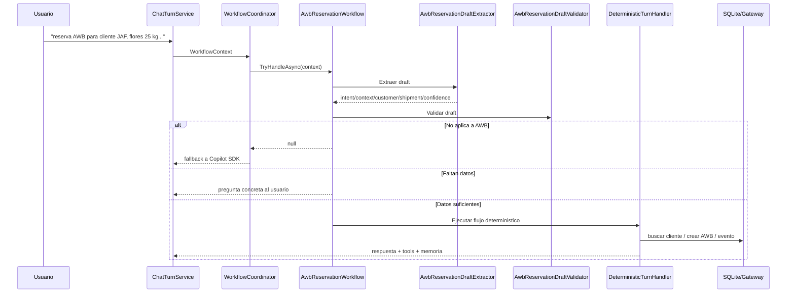

# AgentOrion - Workflows hibridos

Este documento fija el enfoque arquitectonico para los flujos operativos de AgentOrion V1 y deja una base clara para agregar mas flujos en V2.

## Decision base

`WorkflowCoordinator` no es un agente ni un LLM. Es un coordinador liviano que recorre implementaciones de `IAgentWorkflow` y toma el primer resultado que pueda responder el turno.

Cada workflow puede combinar IA y codigo, pero con responsabilidades separadas:

## Contrato V1

- `WorkflowContext`: lleva prompt, memoria conversacional, `sessionId` y modo de chat.
- `IAgentWorkflow`: decide si el turno pertenece a ese proceso y devuelve `DeterministicTurnResult` o `null`.
- `IWorkflowInputExtractor<TDraft>`: convierte prompt + memoria en un draft estructurado.
- `IWorkflowValidator<TDraft>`: valida si el workflow aplica, si puede ejecutar y que campos faltan.
- `IWorkflowResponseComposer<TDraft>`: redacta la pregunta de datos faltantes.

## Donde entra IA

La IA debe entrar principalmente en el extractor y, si conviene, en el composer de respuesta:

- Extractor actual AWB: reglas locales, rapido y testeable.
- Extractor futuro AWB: LLM con salida JSON tipada para interpretar lenguaje libre.
- Validator: codigo C# deterministico. No debe depender de creatividad del modelo.
- Executor: codigo C# y tools. Solo se ejecuta cuando la validacion lo permite.

La regla de seguridad es simple: la IA puede ayudar a entender y redactar; el codigo decide si se puede ejecutar.

## Flujo AWB actual

## Como agregar otro workflow

Para un nuevo proceso, por ejemplo `CustomerOnboardingWorkflow`:

1. Crear un draft tipado: `CustomerOnboardingDraft`.
2. Implementar `IWorkflowInputExtractor<CustomerOnboardingDraft>`.
3. Implementar `IWorkflowValidator<CustomerOnboardingDraft>`.
4. Implementar `IWorkflowResponseComposer<CustomerOnboardingDraft>`.
5. Implementar `IAgentWorkflow`.
6. Registrar los cuatro servicios en DI.
7. Agregar pruebas de routing, extraccion, validacion, respuesta y ejecucion.

## Linea de evolucion

V1 usa reglas locales para mantener control y pruebas rapidas. V2 puede sustituir extractores por implementaciones con Copilot SDK o un mini-router LLM, sin cambiar `WorkflowCoordinator` ni `ChatTurnService`.

El orden recomendado:

1. Mantener validators y executors deterministicos.
2. Agregar extractores IA con JSON schema y pruebas golden.
3. Persistir `WorkflowState` cuando un flujo tenga varios pasos largos.
4. Medir calidad con dataset de ruta + campos extraidos + tools + respuesta.
5. Agregar aprobacion humana solo para tools mutantes reales o integraciones externas criticas.
